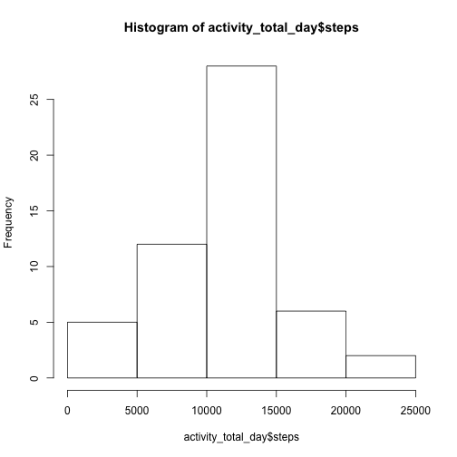
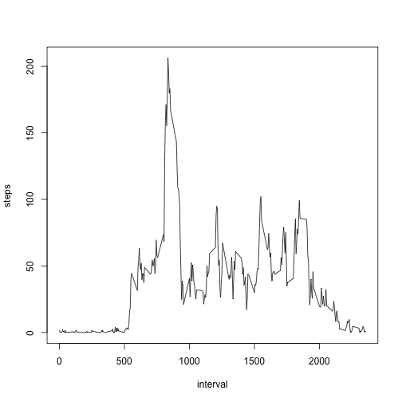
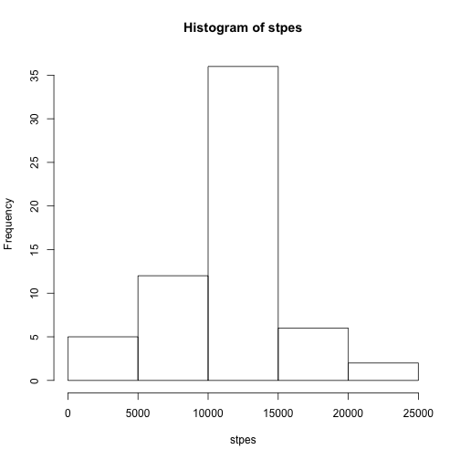
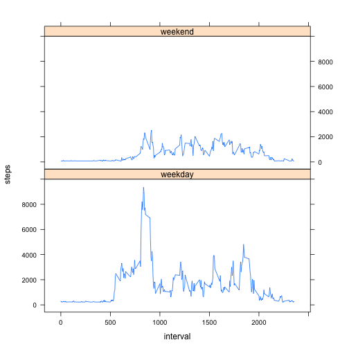

##Loading and preprocessing the data

- Load the data

```r
 activity <- read.csv("~/RepData_PeerAssessment1/activity.csv", stringsAsFactors = FALSE)
```

- Transform the data


```r
activity$date <- as.Date(activity$date)
activity_total_day <- group_by(activity, date) %>% summarise(sum(steps))
names(activity_total_day) <- c("date", "steps")
```

##What is mean total number of steps taken per day?

- Calculate the total number of steps taken per day

```r
mean(activity_total_day$steps, na.rm = TRUE)
```

```
## [1] 10766.19
```

- Make a histogram of the total number of steps taken each day

```r
hist(activity_total_day$steps)
```



- Calculate and report the mean and median of the total number of steps taken per day


```r
mean(activity_total_day$steps, na.rm = TRUE)
```

```
## [1] 10766.19
```

```r
median(activity_total_day$steps, na.rm = TRUE)
```

```
## [1] 10765
```

##What is the average daily activity pattern?

- Make a time series plot


```r
steps_interval <- group_by(activity, interval) %>% summarise(mean(steps, na.rm = TRUE))
names(steps_interval) <- c("interval","steps")
with(steps_interval, plot(interval, steps, type = "l"))
```



- Which 5-minute interval, on average across all the days in the dataset, contains the maximum number of steps?


```r
steps_interval$interval[which.max(steps_interval$steps)]
```

```
## [1] 835
```

##Imputing missing values

- Calculate and report the total number of missing values in the dataset 


```r
sum(is.na(activity$steps))
```

```
## [1] 2304
```

- Devise a strategy for filling in all of the missing values in the dataset
  : I will fill NA's with mean of steps of all day

- Create a new dataset that is equal to the original dataset but with the missing data filled in


```r
step_mean <- round(mean(activity$steps, na.rm = TRUE), 0)  #find a mean value of stpes of all days
activity_filled <- activity                                #create a new data set without NA's
for(i in 1:nrow(activity)) {                            
  if(is.na(activity_filled[i, 1])) {
    activity_filled[i, 1] <- step_mean
  }
}
```

- Make a histogram of the total number of steps taken each day and Calculate and report the mean and 
  median total number of steps taken per day.


```r
activity_filled_daysum <- group_by(activity_filled, date) %>% summarise(sum(steps))
names(activity_filled_daysum) <- c("date", "stpes")
with(activity_filled_daysum, hist(stpes))
```



- Report the mean and median total number of steps taken per day


```r
paste("mean = ", round(mean(activity_filled_daysum$stpes), 0))
```

```
## [1] "mean =  10752"
```

```r
paste("median = ", median(activity_filled_daysum$stpes))
```

```
## [1] "median =  10656"
```

##Are there differences in activity patterns between weekdays and weekends?

- Create a new factor variable in the dataset with two levels ??? ???weekday??? and ???weekend??? indicating whether
  a given date is a weekday or weekend day.


```r
activity_weekday <- activity_filled %>% mutate(day = weekdays(date))
activity_weekday$day <- as.factor(activity_weekday$day)
levels(activity_weekday$day) <- list("weekday" = c("Monday","Tuesday","Wednesday","Thursday","Friday"),
                                     "weekend" = c("Saturday","Sunday"))
```

- Make a panel plot containing a time series plot


```r
activity_weekday_total <- activity_weekday %>% group_by(day, interval) %>% summarise(sum(steps))
names(activity_weekday_total) <- c("day","interval","steps")
xyplot(steps ~ interval | day, type = "l", data = activity_weekday_total, aspect = 1/2)
```


